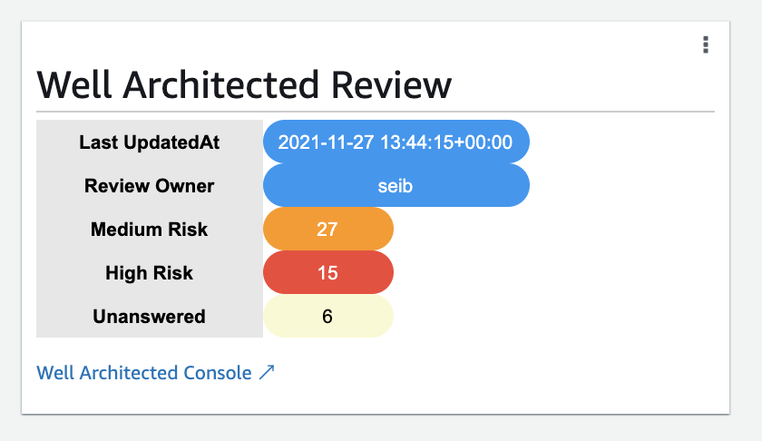

## Well Architected Status Cloudwatch Dashboard Custom Widget

Add a widget with counts of high and medium risk items to a dashboard. Usefully as part of a Ops dashboard for your workloads.

While there are all sorts of dashboards that teams can use to continuosly monitor and improve their operations, this widget could be part of a weekly review to alert people of the progress and work to be done to improve the customer experience. 

Each week, Amazon teams and broader organizations also run operations review meetings that are attended by senior leaders, managers, and many engineers. During those meetings we use a wheel of fortune to choose high-level audit dashboards. Stakeholders review our customers’ experience and key service-level objectives, such as availability and latency. The audit dashboards that these stakeholders use typically show operational data from all Availability Zones and Regions.
Read more in the [Builder's Library Article](https://aws.amazon.com/builders-library/building-dashboards-for-operational-visibility/)

